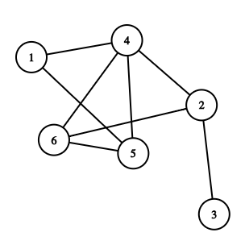

# Graphs Handling

The graph format must be like, no loop and your node must begin 
by 1 and never mind for espace or tab to separate the nodes of a edges:
```
6 2
6 4
6 5
1 4
1 5
2 3
2 4
4 5
```


## Ploting Graph network

Ploting with No color of node

```
./graph_plot.py <file_links>
```

Ploting with color
```
file_color : node id_color
example:
    1 0
    2 0

./graph_plot_color.py <file_links> <file_color>
```

## Compute number of nodes and edges 
Before to manipulate a graph you have know some proprieties
```
./n_of_node <file>
```

``` example:
./n_of_node graph.txt

Output:
n_of_node : 6
n_of_edge : 8
```

## Compute connected components
The algorithm used is [BFS!](https://en.wikipedia.org/wiki/Breadth-first_search)
```
print_args:
p = pint all component important for debuging
s = print the size of each connected component
m = print the size of big connected component and a node of this component and the total components

./connected <file> <n_of_node> <n_of_edge> <print_args>
```

## Compute the good bound diameter of the big component
Compute the good lower bound diameter of a graph, like known a graph can have many 
connected components
```
p = print the diameter of each connected component
n = print the diameter of good lower bound

./diameter <file> <n_of_node> <n_of_edge> <node_amount> <p or n>
```

## Compute the triangles
To compute triangles, you have follow execute some commands before(Preparing the graph)

### Preparing the graph
For the results to be true, you have to prepare the file.
```
./direct_by_deg <file_orignal> <n_of_node> <n_of_edges> > <file_directed>
sort -n -k2 <file_directed> > <file_directed_sorted>
```

### computing triangle
After file prepared, you can compute triangles.
```
p = print all triangles
n = print the number of triangles

./triangle <file_directed_sorted> <n_of_node> <n_of_edge> <p or n>
```

## Compute communauties

To validate a communauties dectection algorithm, you have generate some clusters that you know
for testing your algorithm.

### Clusters generating

Generate clusters and for each link (u,v), node u and node v in the same cluster with
have a link with probability p and not with the probability q. Probability ([0.0-1.0])

+ n_of_node    : min 100 nodes
+ n_of_cluster : max 10 clusters

```
./cluster <n_of_node> <n_of_group> <p> <q>

Example:
./cluster 400 4 0.6 0.005 > clusters0.txt
```


### Using label propagation

the label propagation
[algorithm ](https://en.wikipedia.org/wiki/Label_propagation_algorithm)

```
times = number of iterations
p     = print node with their communauty id
n     = no print 
./label <times> <file> <n_of_node> <n_of_edges> <p or n>
```

### Modularity 
I recommand to use this [algorithm](https://fr.wikipedia.org/wiki/Méthode_de_Louvain) for communauty dectection.
The source is from this link [https://sourceforge.net/projects/louvain/](https://sourceforge.net/projects/louvain/)

### Using 3-clique

### Page Rank
PageRank implemented the pagerank of a link is around [0% -100%]

```
p = print (node,page_rank value)
i = print (node, page_rank, deg_in of page) 
o = print (node, page_rank, deg_out of page)
n = print the 20  ranked page (page id,page_rank)
t = print iterations

./page_rank <file> <n_of_node> <n_of_edge> <alpha> <theta> <p,i,o,or n>
```

### K-Core
Compute core value of a graph
```
p = print (node,core value,degree of node)
n = + print max core value 
    + ordered by this core value print also
        - average degree density
        - edges density
        - denset graph

./kcore <file> <n_of_node> <n_of_edge> <p,n>

example:
./kcore ~/stl-cpa-datasets/CPA_Data/com-amazon.ungraph-clean.txt 548551 925872 n
```

### Score value
Compute density score [Maximilien Danisch][https://drive.google.com/file/d/1ANtqxudwaqZHX3lrBFXclp2XO-fyNDY7/view]
```
p = print (node,score)
n = print ordered by score value
    + average degree density
    + edges density
    + denset graph
./score <file> <n_of_node> <n_of_edge> <p,n>
``` 